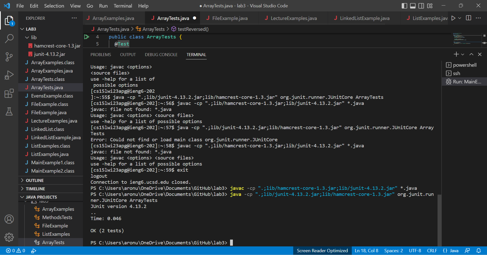
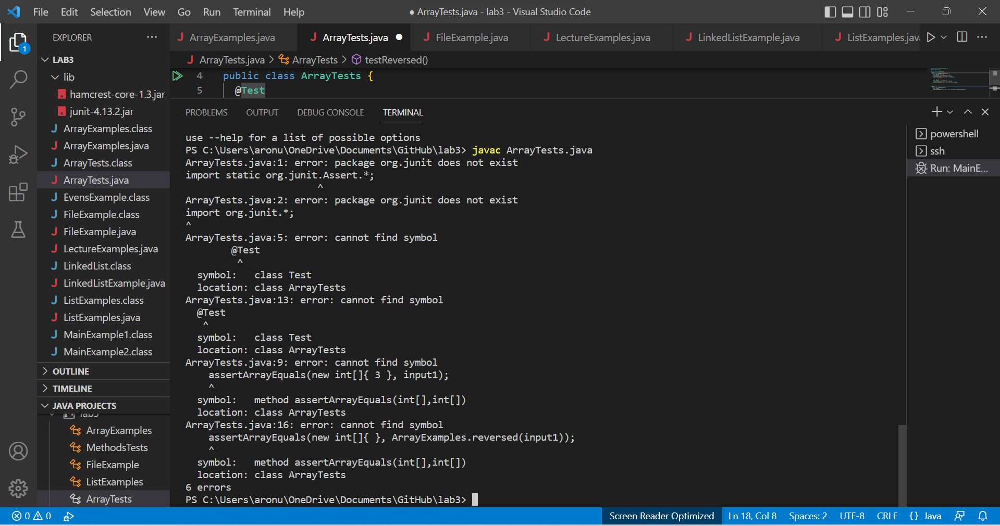
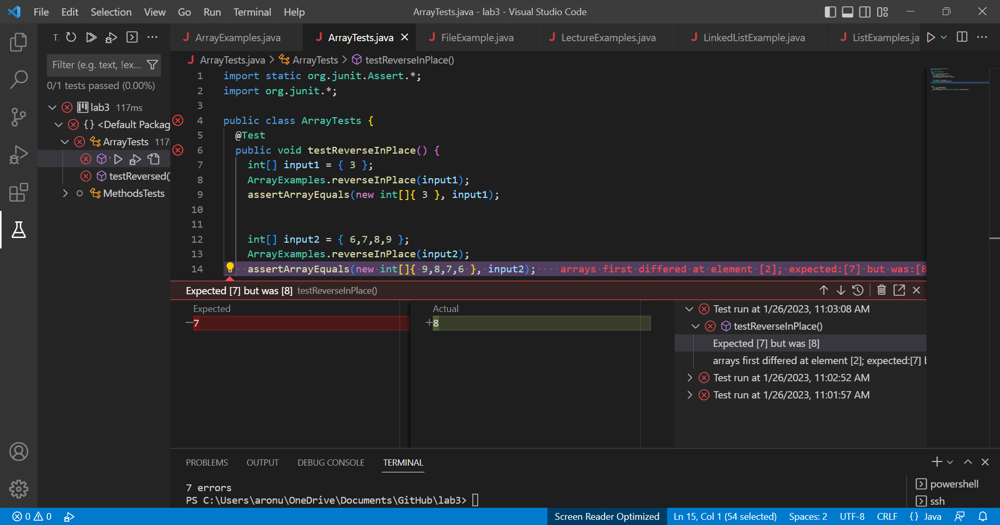
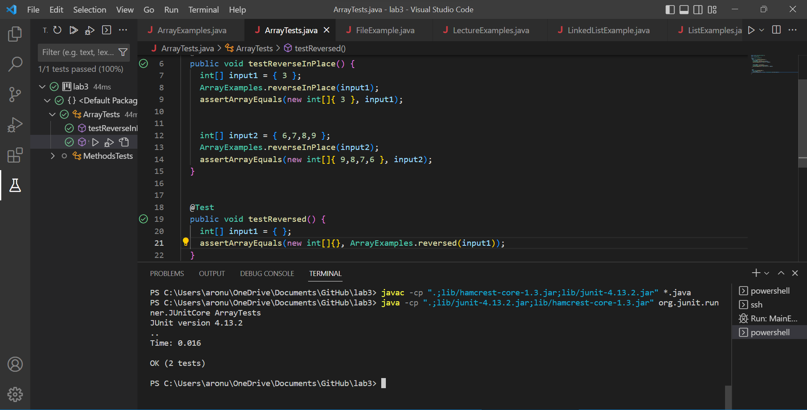

PART 1

Part 2

As we see the package for windows is a bit different than Mac and when I entered the command line the package was not found.and there are some errors in the ArrayTests as we see.
So after I fix the bug all the tests are correct as it shows below.Created a temporary array to hold the reversed array and then deep copied back into arr[] after temp was reversed. We had to make changes to arr[arr.length-1-i], changing it with a temp count which we set = to arr.length and updated every time we looped through. The code change you need to make to fix the bug
reverseInPlace -.So I made some changes to the ArrayTests.java but when I compile it the is an error and as we can see the Expected result is different from the Actual result so in taht case I have to make some arrange in the ArrayExamples in the reverseInPlace.

