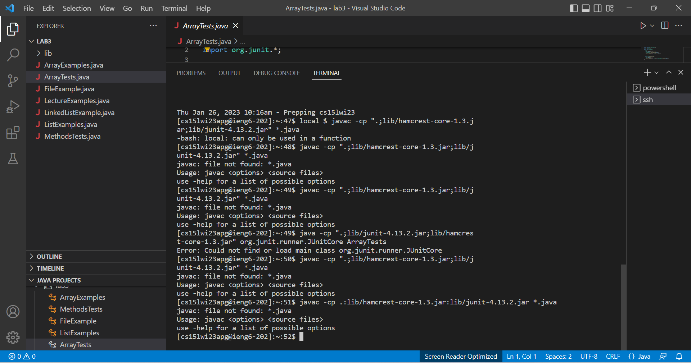

PART 1

Part 2

The bug that I choose in this part is from the ArrayTests as we see the package for windows is a bit different than Mac and when I entered the command line the package was not found.and there are some errors in the ArrayTests as we see.
So after I fix the bug all the tests are correct as it shows below.Created a temporary array to hold the reversed array and then deep copied back into arr[] after temp was reversed. We had to make changes to arr[arr.length-1-i], changing it with a temp count which we set = to arr.length and updated every time we looped through. The code change you need to make to fix the bug
reverseInPlace -.So I made some changes to the ArrayTests.java but when I compile it the is an error and as we can see the Expected result is different from the Actual result so in taht case I have to make some arrange in the ArrayExamples in the reverseInPlace.

Part 3

I didn't know how to host a local web server. I was so suprizes by using ssh and access i can have a remot control from any device.also the search engine shows as that how much you can control with URL manipulation. this is amezing thing to me.and also this shows me is if im connected to the web server how could afect my URL.
